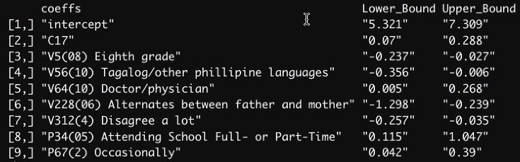

```{r setup, include=FALSE}
knitr::opts_chunk$set(echo = FALSE)

library(tidyverse)
library(sjlabelled)  # for remove_all_labels()
library(glmnet)
```

```{r cleaning, include=FALSE}
# import
load('ICPSR_20520/DS0001/20520-0001-Data.rda')

# get features and response
cils <- as_tibble(da20520.0001) %>%
  filter(!is.na(V421)) %>%
  select(!c(CASEID, V1)) %>%
  remove_all_labels()

log.income <- cils %>%
  pull(V421) %>%
  log()

# drop 2005 variables
cils <- cils %>%
  select(!matches('V4[[:alnum:]]{2,}'))

# deal with numeric variables
numeric <- cils %>%
  select(where(is.double))

numeric <- numeric %>%
  select(where(~ sum(is.na(.x)) / length(.x) < 0.5)) %>%                        # select variables less than 50% NA
  mutate(across(.cols = everything(), is.na, .names = '{.col}_NA')) %>%         # add dummy NA columns
  mutate(across(.cols = ends_with('_NA'), as.double)) %>%                       # turn dummy NA columns to double
  mutate(across(.cols = !ends_with('_NA'),
                ~ if_else(is.na(.x), mean(.x, na.rm = TRUE), .x))) %>%          # mean imputation
  as.matrix()

# deal with categorical variables
categorical <- cils %>%
  select(where(is.factor))

categorical <- categorical %>%
  select(where(~ nlevels(.x) <= 25)) %>%                                        # drop variables with more than 25 levels
  mutate(across(.cols = everything(), addNA))                                   # make NA a level
categorical <- model.matrix(~ ., data = categorical)[ ,-1]                      # create design matrix, excluding intercept
```

```{r analysis, include=FALSE, eval=FALSE}
# combine
combined <- cbind(log.income, numeric, categorical)

# test-train split
set.seed(123)

indices <- sample(1:nrow(combined), size = 0.7*nrow(combined))

test <- combined[-indices, ]
train <- combined[indices, ]

# actual lasso
cv <- cv.glmnet(x = train[ ,-1],
                  y = train[ ,1],
                  type.measure = 'mse',
                  standardize = TRUE,
                  family = 'gaussian',
                  alpha = 1)

# lasso bootstrap
tmp_coeffs_collection = list()
for (i in 1:10){
  cv_boot <- cv.glmnet(x = train[, -1],
                       y = train[, 1],
                       type.measure = 'mse',
                       standardize = TRUE,
                       family = 'gaussian',
                       alpha = 1)

  # get names of nonzero coefficient variables
  tmp_coeffs <- coef(cv_boot, s = "lambda.min")
  tmp_coeffs <- data.frame(name = tmp_coeffs@Dimnames[[1]][tmp_coeffs@i + 1], coefficient = tmp_coeffs@x)
  tmp_coeffs <- tmp_coeffs[-1, ]
  tmp_coeffs_collection = append(tmp_coeffs_collection,tmp_coeffs[1])
}
tmp_coeffs = Reduce(intersect,tmp_coeffs_collection)

# bootstrap:
bootstrap_size = 1000
lm_coefficients_collection = matrix(nrow = length(tmp_coeffs) + 1,ncol = bootstrap_size)

for (i in 1:bootstrap_size){
  boot_indics = sample(nrow(test),replace = T)
  boot_sample = test[boot_indics,]
  # create formula for lm
  coeffs <- tmp_coeffs %>%
    str_replace_all('[[:punct:]]*[[:space:]]*[=+]*', '')
  formula <- paste('logincome ~', paste(coeffs, collapse = ' + '))

  colnames(boot_sample) <- str_replace_all(colnames(boot_sample), '[[:punct:]]*[[:space:]]*[=+]*', '')

  reg <- lm(formula = formula,
            data = as.data.frame(boot_sample))
  lm_coefficients_collection[,i] = reg$coefficients
}

# percentile interval
CIs_lower = apply(lm_coefficients_collection, MARGIN = 1,quantile,probs = 0.025,na.rm = T)
CIs_upper = apply(lm_coefficients_collection, MARGIN = 1,quantile,probs = 0.975,na.rm = T)
coeffs_names = append('intercept',tmp_coeffs)
CIs_table = cbind(coeffs = coeffs_names,Lower_Bound = round(CIs_lower,3),Upper_Bound = round(CIs_upper,3))
```


```{r regular, include=FALSE, eval=TRUE}
# combine
combined <- cbind(log.income, numeric, categorical)

# test-train split
set.seed(123)

indices <- sample(1:nrow(combined), size = 0.7*nrow(combined))

test <- combined[-indices, ]
train <- combined[indices, ]

cv <- cv.glmnet(x = train[ ,-1],
                y = train[ ,1],
                type.measure = 'mse',
                standardize = TRUE,
                family = 'gaussian',
                alpha = 1)

# get names of nonzero coefficient variables
# max stole all this code so don't ask him how it works
tmp_coeffs <- coef(cv, s = "lambda.min")
tmp_coeffs <- data.frame(name = tmp_coeffs@Dimnames[[1]][tmp_coeffs@i + 1], coefficient = tmp_coeffs@x)
tmp_coeffs <- tmp_coeffs[-1, ]

# create formula for lm
coeffs <- tmp_coeffs$name %>%
  str_replace_all('[[:punct:]]*[[:space:]]*[=+]*', '')
formula <- paste('logincome ~', paste(coeffs, collapse = ' + '))

colnames(test) <- str_replace_all(colnames(test), '[[:punct:]]*[[:space:]]*[=+]*', '')

reg <- lm(formula = formula,
          data = as.data.frame(test))
```

\newpage

# 1 Introduction

One key measure of immigrant assimilation is financial standing. In this report, we investigate what individual characteristics and family backgrounds of school-aged second-generation immigrants in the United States *predict* income roughly a decade in the future. We will construct a LASSO-regularized model to predict incomes of second-generation immigrants, interpret it, and discuss its limitations and applications. 

By predicting income a decade in advance, our model aims to help the public institutions identify the second-generation Americans that are projected to earn less than 500 dollars per month so that they could help those in need in a timely manner.  

Meanwhile, we also investigated what makes immigrants more adaptive and successful to mainstream society than others by understanding the factors associated with higher or lower incomes. We achieved this by refitting an ordinary least squares model to the variables selected by LASSO and interpreted its coefficients. 
 
# 2 Data Description

Our dataset comes from the Children of Immigrants Longitudinal Study (CILS), conducted over the years 1991-2006 by the Center for Migration and Development at Princeton University. Data were obtained in three different survey rounds from respondents living in San Diego and Miami/Ft. Lauderdale metropolitan areas in 1992, the time of the first survey. At this time, respondents were in eighth and ninth grade. This survey established baseline information on immigrant families and had a sample size of 5562 respondents. The second survey was conducted in 1995, as respondents were about to graduate high school. This survey studied the development of respondents through their adolescent years, and only 4288 respondents were able to be reached. At the same time as this survey was conducted, half of the childrens’ parents were interviewed in order to directly establish characteristics of immigrant parents. The final survey was finalized by 2005, when respondents had reached adulthood. 3613 respondents were reached, and they were asked questions about their adult life, including their monthly income.

The raw dataset consists of 5262 observations of 665 variables. We will only use data from the first and second survey to predict their reported income, which comes from the third survey. In doing so, we actually use characteristics of individuals from middle and high school age or before to predict incomes roughly one decade after leaving high school.

## 2.1 EDA

Since our dataset has a very large number of variables, we do not focus much effort on typical exploratory data analysis, such as looking at univariate and bivariate plots. Instead, we combine exploration with data processing, especially when we decide how to handle missing values, which are extremely prevalent. This work is described in Section 2.2 below. 

We do, however, examine the distribution of our response variable `V421`, ‘Total monthly earnings’. Since earnings are heavily left-skewed, we apply a natural log transformation. Our resulting variable `log.income` is approximately normal, satisfying the normality assumption under the standard linear model.

```{r eda, fig.width = 3, fig.height = 2, echo = FALSE}
ggplot(data = da20520.0001, aes(x = V421)) + 
  geom_histogram(na.rm = TRUE, binwidth = 500,
                 fill = "#69b3a2", color = "#e9ecef", alpha = 0.9) +
  xlab("income") +
  ylab("Frequency") +
  theme_minimal()

ggplot(data = da20520.0001, aes(x = log(V421))) + 
  geom_histogram(na.rm = TRUE, binwidth = 0.4,
                 fill = "#69b3a2", color = "#e9ecef", alpha = 0.9) +
  xlab("log(income)") +
  ylab("Frequency") +
  theme_minimal()
```

## 2.2 Processing

Our data processing is geared primarily towards preparing our dataset for use with lasso, which is used to help narrow down our dataset to a much smaller number of relevant variables. The justification for using lasso is provided in Section 3. The processing steps are described below:

1. Since our objective is to predict income, we drop all observations with missing values for income. This roughly halves our observations, reducing our dataset down to 2603 individuals. Two issues arise from this. The first is that bluntly removing all observations with missing values for income greatly reduces our power. While it is possible to use an imputation model for income, we elected not to because of the complexity behind such a model. Second, individuals with missing incomes may differ from individuals who are not missing income along other characteristics, which could introduce selection bias into our final estimated coefficients. This limitation is discussed in Section 7.

2. Two variables, `CASEID` and `V1`, are purely administrative identification numbers for each individual, and are dropped, reducing the number of variables to 663.

3. Our response variable income, `V421`, is pulled from our dataset. Other variables collected at the same time as our income variable, i.e. variables from the final survey, are dropped. Only variables from the first two surveys and the parent survey conducted at the same time as the second survey are kept. This reduces our dataset to 538 predictor variables.

The raw dataset is rife with missing values for both numeric and categorical data, which poses a significant issue for the lasso. To handle these missing values, we took the following steps below:

1. Since our process for handling missing values differs between numeric and categorical variables, we temporarily split our dataset. 77 of our variables are numeric, and the remaining 461 are categorical.

2. For numeric variables, columns with 50 percent or more missing values are dropped. We did not wish to drop variables with between 0 and 50 percent missing values, but we also wished to avoid a complex imputation step, so for these variables we performed mean imputation. While this is a simple solution, it does run into the possibility of severely changing the distribution of our numeric variables by adding a large spike of density at the mean. To address this, we add a dummy column for each numeric variable, with a value of 1 if the corresponding observation was missing and 0 otherwise. This lets us preserve missingness information for each variable. If in our analysis we find a mean-imputed variable that is significant and we also find that its associated dummy column is significant, we should feel cautious about the variable having a real effect.

3. For categorical variables, we drop all columns with more than 25 levels. This rule was intended to ensure that each level had at least 100 observations, given that we have 2603 observations. In reality, this was not the case, as most observations are found in just a handful of levels, but this rough threshold still worked well for our purposes.
45 columns were removed according to this rule. All of these columns had to do with either occupation---for example, `V32`, ‘Father’s regular occupation’; countries---`V15`, ‘Mother’s birth country; language---`V58`, ‘Language respondent uses w/ parents’; ethnicity or nationality---`V78`, ‘How respondent identifies his/herself’; or in the case of `V4`, anonymized school names. Most of the levels within each variable contained less than 5 percent of observations within the full sample (all 5262 observations), and quite a few had only one to five observations. For some variables, a fraction of levels had no observations at all.
With such small counts for levels, not removing these columns allows for the possibility for an observation with an extreme value for income in a level with only a handful of observations to greatly influence the size of its estimated coefficient. Indeed, in our initial fits we saw observations with very large incomes causing the coefficients of dummy columns representing an uncommonly spoken language to be extremely large and highly statistically significant. With only a tiny percent of observations being contained this level, it is clear our model was overfitting.

Admittedly, this process was quite crude. For many of these variables, a few levels clearly dominated. For example, in the language variables the most common levels were usually English, Spanish, Tagalog, Vietnamese, and missing. While it would have been possible to recode the levels of these variables to something like `English`, `Spanish`, `NA`, and `Other`, we chose not to for two reasons. First, this process would have been very time-consuming, as each variable would have to be manually recorded. Second, it is unclear if this kind of processing would have been useful. There are two main ways we could have chosen to relevel our variables. First, we could have binarized the nonmissing values, e.g. `English` and `Not English`. Second, we could have kept the most common categories according to some rule, say, preserve all levels with more than 10 percent of the observations in the reduced sample, and combine all other levels into `Other`. The issue is that these strategies are somewhat unhelpful unless our criteria for releveling were meaningful. For example, to relevel ‘Mother’s birth country’ to just the most common countries, `Philippines`, `Vietnam`, or `Other`, seems somewhat arbitrary, and the loss of information from crushing all other countries into just Other is quite severe. Finally, NA was turned into a level.

It is possible to regroup these variables into more coherent categories, such as geographical region, and we originally intended to do so, but choosing the right groups would be quite complex and time-consuming. Much like a complex imputation method, this releveling procedure would introduce excessive complexity, and so we chose to go with the simpler alternative of discarding these categories, similar to our choice to use mean imputation for the numerical variables. Notably we do not entirely take language-related variables out of our model: some language variables have fewer than 25 categories, and we do not run into an overfitting issue when including them. Additionally, other language metrics, such as English proficiency (`C5`), remain in our model, and these variables arguably capture more of the language-related information we are interested in than a variable that simply lists out each language that was spoken. In other words, whether you speak Tagalog versus Vietnamese versus Spanish at home (`V56`) does not matter as much as the fact that you do not speak *English* at home.

# 3 Model Selection

Since our final design matrix has 5728 variables, performing variable selection is critical. For this reason, we choose to use lasso (Least Absolute Shrinkage and Selection Operator) in our model selection process. Lasso is a modification of ordinary least squares that introduces a constraint on the size of the estimated coefficients.

Any subset selection method is not possible since the number of predictors exceeds the number of observations, 2603. Additionally, we choose not to use ridge regression, despite having a predictive advantage over lasso, because of two reasons. First, the users of our model need to collect less data in order to make a prediction for future income. The ridge model requires the user to collect information on 1339 variables, whereas the LASSO model only requires around 100. Second, we want to perform inference after model selection by refitting an OLS on the variables selected by Ridge/LASSO. Since LASSO will give a sparse solution by forcing most coefficients down to zero, it will make our inference easier. To avoid the issues associated with post-model-selection inference as well as doing prediction, we split our data into a training set and a test set, using a 70-30 split.

Standardization of variables is required before using lasso. We additionally wish to perform cross-validation of the model fit at each value of $\lambda$. The function `cv.glmnet()` from package `glmnet` performs both for us. All variables, including dummies, are standardized, and 10-fold cross-validation is performed.

One important thing that we noticed is that the variables selected by LASSO are somewhat different each time. This is due to randomness of the cross-validation step, which leads to a different optimal lambda being used each time. To reduce the randomness, we performed the cross-validation step 10 times and selected only the common coefficients that are returned by lasso each time. 

We also looked at the model using `lambda.1se` - lambda within one standard error from the minimum, and we discovered that the null model with only the intercept frequently appeared, which indicates that our mode using `lambda.min` might only be marginally better. This is discussed further in our prediction and limitations section. 


# 4 Model Diagnostics

```{r diagnostics, fig.width=8, fig.height=6, warning=FALSE}
par(mfrow = c(2,2))
plot(reg)
```

Referring to the plots above, our Residual vs. fitted plot reveals that our residuals have a constant variance since all of the residuals appear to be evenly spread out around zero. This implies that the linearity assumption is met for our linear model.

The Normal Q-Q plot reveals that our residuals are approximately normal in the middle, but it is making some tails at our model's upper and lower quantiles - especially at the lower quantiles. This is because the magnitudes of the residuals on both ends are more extensive, and because we failed to meet the normality assumption, our coefficient doesn't strictly follow t-distribution. This means that we should do some bootstrapping to proceed with some inference analysis.

The scale-location plot usually shows whether or not the residuals are equally distributed along with the range of fitted values. However, our plot indicates our model failed to meet a constant variance assumption since it does not have a straight line. We can observe that we have a smaller variance for a smaller y-value.

Lastly, the Residuals vs. Leverage plot shows the influence that each observation has on the fitted coefficient, but we can't detect any points that are influential except a couple of observations with high leverage (Observation 414, 212, and 485). This indicates that we do not need to worry about a possible influential point.

# 5 Prediction

```{r prediction, include=FALSE}
test.pred <- predict(cv, s= cv$lambda.min, newx= test[ , -1],
interval="prediction", level=0.95) # test set predictions
train.pred <- predict(cv, s = cv$lambda.min, newx=train[ , -1])
null.pred <- predict(cv, s = cv$lambda.1se, newx = train[ , -1])

df_test <- as.data.frame(test)
df_train <- as.data.frame(train)
df_test.pred <- as.data.frame(test.pred)
df_train.pred <- as.data.frame(train.pred)
df_null.pred <- as.data.frame(null.pred)

log_income <- df_test$logincome

fit.plot <- ggplot(df_test.pred, aes(x=log_income, y=s1)) +
  geom_point() +
  geom_smooth(aes(color="model"), stat="smooth", method="gam", formula=y~s(x, bs="cs")) +
  geom_line(aes(x=seq(min(log_income, na.rm = TRUE), max(log_income, na.rm = TRUE),
                      length.out=length(log_income)),
                y=seq(min(log_income, na.rm = TRUE), max(log_income, na.rm = TRUE),
                      length.out=length(log_income)),color="ideal")) +
  geom_line(aes(y = 7.314, color = "null (lambda = 1SE)"), size =1)+
# creates ideal model line
  labs(x="actual values", y="predicted values") +
  scale_color_manual("linear relation", values=c("red", "blue", "green")) +
  theme(plot.title = element_text(hjust = 0.5), legend.position = c(0.25, 0.8)) + 
  # add legend of lines
  ggtitle("Linear Model: Predicting Log Income") +
  annotate(geom="text", size =3, x = 9, y = 6.5, 
           label = paste("Train RMSE:", 
                         round(sqrt(mean((df_train.pred$s1 - df_train$log.income)^2)), 2)),
           color="red") + 
  annotate(geom="text",size =3, x = 9, y = 6,
           label=paste("Test RMSE:",
                       round(sqrt(mean((df_test.pred$s1 - df_test$logincome)^2)),2)),
           color="red") +
  annotate(geom="text",size =3, x = 8.5, y = 5.5,
           label=paste("Intercept model RMSE (Train):",
                       round(sqrt(mean((mean(df_train$log.income) - df_train$log.income)^2)),2)),
           color="red") +
  annotate(geom="text",size =3, x = 8.5, y = 5,
           label=paste("Intercept model RMSE (Test):",
                       round(sqrt(mean((mean(df_test$logincome) - df_test$logincome)^2)),2)),
           color="red") +
  theme_minimal()
```

```{r prediction-plot1, fig.width=6, fig.height=3}
fit.plot
```

At the beginning of our analysis, we reserved 30% of our observations from our cleaned dataset to evaluate our model's performance in predicting log.income. We used our model to predict the log.income of the test set and plotted our prediction against the actual log.income to make a scatter plot. The figure above shows that our best-fit line of the scatter plot does not match the ideal model. Also, we can observe that the RMSE of prediction using the train set is higher than that using the test set. Overall, these observations imply that our model will likely predict future income with very low precision, and the predictive power of our model is deficient. 

In addition to the previous plot, the residual plot also tells us that our model is unsuitable for prediction. Our residual plot looks fine overall - our residual spreads out evenly, and there are not many extreme values.  However, looking at this plot more closely, we can observe some linear patterns in the middle (2~3 linear patterns), and this suggests that our model may violate one of our assumptions that the mean of our error must be equal to 0. Violation of the assumptions of linear modeling might cause our model to be less predictive.

Interestingly, all these problems about our model (which uses the minimum lambda) may tell us that it might be better to use the lambda = 1se model. One of the advantages of using the lambda = 1se model is that this model is way simpler than our original model because the model with lambda = 1SE is a NULL model, which uses a mean of log_income as our prediction. The figure above clearly shows that even though the NULL model has less predictive power than our original model (RMSE is higher for the NULL model), it makes a very similar prediction to our original model: lines and RMSE are incredibly close. If they give a similar prediction, just using a simpler model can be a better choice.

# 6 Inference

We refitted an OLS model using the variables chosen by LASSO to get unbiased estimates for the coefficients. After examining the model diagnostics plots for the OLS model, we see that the constant variance and the normal assumption do not meet. Since the t-distribution depends on both assumptions, we used the bootstrap to generate the standard errors and confidence intervals for the coefficients instead. We chose the percentile interval method to generate the confidence interval rather than the normal approach and the studentized approach. Our reasoning is that the percentile interval method doesn’t depend on the assumption of the bootstrap sampling distribution being normal, nor does it depend on the constant variance assumption, which the studentized approach depends on for generating the standard error of the betas. The chart below shows the variables whose coefficients whose 95% confidence levels don't contain 0 along with the upper and lower bounds of their confidence intervals. 

```{r boot-coeffs, eval=FALSE}
# extract the coeffients whose 95% confidence levels don't contain 0
CIs_table[!((CIs_table[,'Lower_Bound'] <= 0) & (CIs_table[,'Upper_Bound'] >= 0)),]
```



Out of all 4 significant positive predictors of income, self-esteem (C17) is the most consistent and reliable predictor of income since it has the least missing values out of all 9 significant predictors. One point increase in self-esteem measured by the Rosenberg's Self-Esteem Scale (ranging from 0 to 4) at eighth/ninth grade is associated with 0.07 to 0.28 increase in monthly log income (or 7% to 32% increase in monthly income) 10 years later. 

Other positive predictors of income are V64, P34, and P67. V64 indicates the respondents’ job preferences when they were in eighth or ninth grade. If being a doctor/physician was one’s answer to this question, then there would be an associated 0.005 to 0.268 increase in their future monthly log income (0.5% to 31% increase in income). P34 indicates the respondents’ parent current occupation. If the parent of a respondent indicated that he/she is still attending school, then there would be an associated 0.115 to 1.047 increase in their child’s future monthly log income(12% to 184% increase in income). P67 indicates how often the respondents’ parent has experienced discrimination because of their race or ethnicity, and being occasionally discrimiated is associated with an 0.042 to 0.39 increase in their child’s future monthly log income(4.2% to 47% increase in income) . 

There are 4 predictors that are negatively associated with income. V5 indicates a respondent is in eighth grade (instead of in ninth grade) at the time of the first survey. Being 1 year younger is associated with a decrease of 0.237 to 0.027 in monthly log income. In other words, income is associated with a person’s age - older people tend to make more.  V56 indicates the language spoken at home. If Tagalog/other philippine languages are spoken (14.4% of the respondents), then it’s associated with a decrease of 0.006 to 0.356 in log income. V228 describes a respondent’s present living situation, and if alternating between father and mother is the present situation (instead of living with father and mother or living with father/mother alone),  then the respondent will have an associated decrease of -1.298 to -0.239 in future monthly log income. The most bizarre finding of this report comes from the variable V312, which asks the respondent whether they are popular with the opposite sex. Those who disagree a lot with the statement “I am not popular with members of the opposite sex” have an associated decrease of 0.035 to 0.257 in future log income. 

The findings above are intriguing. However, the effects of some predictors listed above(V64, P34, P67, V228)  are subject to small sample bias. Only 10 of the respondents’ parents (0.2%) indicated that they were still attending school, and only 6.8% of them indicated that they were occasionally discriminated against. Thus,  the sample sizes for those variables are too small to make a definitive conclusion. In addition, some of the coefficients vary a lot, such as the effect of having a parent that is still attending school (12% to 184% increase in future monthly income). The potential reasons are elaborated below.

# 7 Limitations

## 7.1 Limitations of the Survey
One of the biggest limitations in the data is selection bias---people who have reported income might be different from the people who don’t. Only around half of the respondents have their income reported. Since the third survey was conducted when respondents had reached early adulthood, at average age 24, most respondents had left their parents' home, requiring a nationwide tracking effort. In total, the third survey retrieved 3,613 respondents representing 69 percent of the original sample. In addition, some respondents have yet to find a job at age 24, so their monthly income is also not reported. 

The second limitation is that the sample is not representative of all the second generation Americans in the whole U.S. population.  Only the second generation Americans residing in Miami and San Diego are subject to the survey, whose language spoken at home are mainly Spanish (55%), Vietnamese(6%), Tagalog(14.4%), so our findings might not be generalizable to all second generation Americans. In addition, White Americans only account for 15.8% of our survey respondents, while they account for 46% of the second generation Americans in the U.S. based on the Pew Research Center survey[1]. 

## 7.2 Limitations of the Model

When choosing the optimal lambda for the LASSO, we used cross validation and picked the lambda that minimizes the mean squared error. However, we also attempted using `lambda.1se`,  the lambda that is 1 standard deviation from the optimal lambda but gives us a simpler model. Using `lambda.1se`,  only the intercept is preserved after LASSO, indicating that many of the parameters in our lambda.min model might not be as significant as they seem, because the lambda min model is just marginally better than the intercept model. 

Curiously, we do not run into this when using just the numerical variables (and the NA dummies) as our design matrix. Since the numerical variables are a subset of all the variables, it is strange to see lasso prefer the null model rather than a model with, for example, only certain numerical variables when we use `lambda.1se`. We suspect that this issue arises somewhere in the cross-validation step, but we are not certain. If it were possible, we would have liked to more closely investigate the cause of this behavior, both from a theoretical and programming perspective.

In addition, when we fit LASSO for categorical variables, one level in each category will be used as a reference category. To avoid the issue of collinearity with the intercept, the reference category will be automatically dropped from the design matrix, meaning all reference categories variables are omitted during the shrinkage. Thus, when we refit an OLS model to the variables chosen by LASSO, we would omit all the variables that served as the reference levels during the LASSO fitting process. One potential remedy is to exclude the intercept and include all levels within a category as dummies, but since there is no intercept, this will force our model to go through the origin and result in an inaccurate model. 

Lastly, we didn’t include interaction terms during our model fitting process. With more than 500+  categorical variables (2500 + dummies) and 100+ numerical variables, it’s computationally infeasible to consider all possible combinations of numeric and categorical variables as well between two categorical variables.  Without interaction terms, our model won't be able to capture the patterns within the data very well, which might explain why our predictive model has a large mean squared error. One potential remedy is to explore non-linear models such as neural networks or decision trees. 

# 8 Conclusion

As we mentioned in our introduction, through our regression analysis, we wanted to investigate what individual characteristics of second-generation school-aged immigrants in the United States predict income roughly a decade or more in the future. For inference, we identified 8 variables that are statistically significant in predicting income out of 500+ variables. Out of those 8 significant, self-esteem is the most consistent and reliable predictor. However, for prediction, we believe that the null model is better due to its simplicity.

The future direction will be to conduct causal inference to inform policy making rather than only making predictions and associations. To make valid causal inferences, we will collaborate with experts with domain knowledge to identify all the confounders.

\newpage

# Code Appendix

```{r, eval=FALSE, echo=TRUE}
library(tidyverse)
library(sjlabelled)  # for remove_all_labels()
library(glmnet)
```

```{r, eval=FALSE, echo=TRUE}
# import
load('ICPSR_20520/DS0001/20520-0001-Data.rda')

# get features and response
cils <- as_tibble(da20520.0001) %>%
  filter(!is.na(V421)) %>%
  select(!c(CASEID, V1)) %>%
  remove_all_labels()

log.income <- cils %>%
  pull(V421) %>%
  log()

# drop 2005 variables
cils <- cils %>%
  select(!matches('V4[[:alnum:]]{2,}'))

# deal with numeric variables
numeric <- cils %>%
  select(where(is.double))

numeric <- numeric %>%
  select(where(~ sum(is.na(.x)) / length(.x) < 0.5)) %>%                        # select variables less than 50% NA
  mutate(across(.cols = everything(), is.na, .names = '{.col}_NA')) %>%         # add dummy NA columns
  mutate(across(.cols = ends_with('_NA'), as.double)) %>%                       # turn dummy NA columns to double
  mutate(across(.cols = !ends_with('_NA'),
                ~ if_else(is.na(.x), mean(.x, na.rm = TRUE), .x))) %>%          # mean imputation
  as.matrix()

# deal with categorical variables
categorical <- cils %>%
  select(where(is.factor))

categorical <- categorical %>%
  select(where(~ nlevels(.x) <= 25)) %>%                                        # drop variables with more than 25 levels
  mutate(across(.cols = everything(), addNA))                                   # make NA a level
categorical <- model.matrix(~ ., data = categorical)[ ,-1]                      # create design matrix, excluding intercept
```

```{r, eval=FALSE, echo=TRUE}
# combine
combined <- cbind(log.income, numeric, categorical)

# test-train split
set.seed(123)

indices <- sample(1:nrow(combined), size = 0.7*nrow(combined))

test <- combined[-indices, ]
train <- combined[indices, ]

# actual lasso
cv <- cv.glmnet(x = train[ ,-1],
                  y = train[ ,1],
                  type.measure = 'mse',
                  standardize = TRUE,
                  family = 'gaussian',
                  alpha = 1)

# lasso bootstrap
tmp_coeffs_collection = list()
for (i in 1:10){
  cv_boot <- cv.glmnet(x = train[, -1],
                       y = train[, 1],
                       type.measure = 'mse',
                       standardize = TRUE,
                       family = 'gaussian',
                       alpha = 1)

  # get names of nonzero coefficient variables
  tmp_coeffs <- coef(cv_boot, s = "lambda.min")
  tmp_coeffs <- data.frame(name = tmp_coeffs@Dimnames[[1]][tmp_coeffs@i + 1], coefficient = tmp_coeffs@x)
  tmp_coeffs <- tmp_coeffs[-1, ]
  tmp_coeffs_collection = append(tmp_coeffs_collection,tmp_coeffs[1])
}
tmp_coeffs_collection
tmp_coeffs = Reduce(intersect,tmp_coeffs_collection)

# bootstrap:
bootstrap_size = 1000
lm_coefficients_collection = matrix(nrow = length(tmp_coeffs) + 1,ncol = bootstrap_size)

for (i in 1:bootstrap_size){
  boot_indics = sample(nrow(test),replace = T)
  boot_sample = test[boot_indics,]
  # create formula for lm
  coeffs <- tmp_coeffs %>%
    str_replace_all('[[:punct:]]*[[:space:]]*[=+]*', '')
  formula <- paste('logincome ~', paste(coeffs, collapse = ' + '))

  colnames(test) <- str_replace_all(colnames(test), '[[:punct:]]*[[:space:]]*[=+]*', '')

  reg <- lm(formula = formula,
            data = as.data.frame(boot_sample))
  lm_coefficients_collection[,i] = reg$coefficients
}

# percentile interval
CIs_lower = apply(lm_coefficients_collection, MARGIN = 1,quantile,probs = 0.025,na.rm = T)
CIs_upper = apply(lm_coefficients_collection, MARGIN = 1,quantile,probs = 0.975,na.rm = T)
coeffs_names = append('intercept',tmp_coeffs)
CIs_table = cbind(coeffs = coeffs_names,Lower_Bound = round(CIs_lower,3),Upper_Bound = round(CIs_upper,3))
```

```{r, fig.width = 3, fig.height = 2, eval = FALSE, echo=TRUE}
ggplot(data = da20520.0001, aes(x = V421)) + 
  geom_histogram(na.rm = TRUE, binwidth = 500,
                 fill = "#69b3a2", color = "#e9ecef", alpha = 0.9) +
  xlab("income") +
  ylab("Frequency") +
  theme_minimal()

ggplot(data = da20520.0001, aes(x = log(V421))) + 
  geom_histogram(na.rm = TRUE, binwidth = 0.4,
                 fill = "#69b3a2", color = "#e9ecef", alpha = 0.9) +
  xlab("log(income)") +
  ylab("Frequency") +
  theme_minimal()
```

```{r, fig.width=8, fig.height=6, warning=FALSE, eval=FALSE, echo=TRUE}
par(mfrow = c(2,2))
plot(reg)
```

```{r, eval=FALSE}
test.pred <- predict(cv, s= cv$lambda.min, newx= test[ , -1],
interval="prediction", level=0.95) # test set predictions
train.pred <- predict(cv, s = cv$lambda.min, newx=train[ , -1])
null.pred <- predict(cv, s = cv$lambda.1se, newx = train[ , -1])

df_test <- as.data.frame(test)
df_train <- as.data.frame(train)
df_test.pred <- as.data.frame(test.pred)
df_train.pred <- as.data.frame(train.pred)
df_null.pred <- as.data.frame(null.pred)

log_income <- df_test$logincome

fit.plot <- ggplot(df_test.pred, aes(x=log_income, y=s1)) +
  geom_point() +
  geom_smooth(aes(color="model"), stat="smooth", method="gam", formula=y~s(x, bs="cs")) +
  geom_line(aes(x=seq(min(log_income, na.rm = TRUE), max(log_income, na.rm = TRUE),
                      length.out=length(log_income)),
                y=seq(min(log_income, na.rm = TRUE), max(log_income, na.rm = TRUE),
                      length.out=length(log_income)),color="ideal")) +
  geom_line(aes(y = 7.314, color = "null (lambda = 1SE)"), size =1)+
# creates ideal model line
  labs(x="actual values", y="predicted values") +
  scale_color_manual("linear relation", values=c("red", "blue", "green")) +
  theme(plot.title = element_text(hjust = 0.5), legend.position = c(0.25, 0.8)) + 
  # add legend of lines
  ggtitle("Linear Model: Predicting Log Income") +
  annotate(geom="text", size =3, x = 9, y = 6.5, 
           label = paste("Train RMSE:", 
                         round(sqrt(mean((df_train.pred$s1 - df_train$log.income)^2)), 2)),
           color="red") + 
  annotate(geom="text",size =3, x = 9, y = 6,
           label=paste("Test RMSE:",
                       round(sqrt(mean((df_test.pred$s1 - df_test$logincome)^2)),2)),
           color="red") +
  annotate(geom="text",size =3, x = 8.5, y = 5.5,
           label=paste("Intercept model RMSE (Train):",
                       round(sqrt(mean((mean(df_train$log.income) - df_train$log.income)^2)),2)),
           color="red") +
  annotate(geom="text",size =3, x = 8.5, y = 5,
           label=paste("Intercept model RMSE (Test):",
                       round(sqrt(mean((mean(df_test$logincome) - df_test$logincome)^2)),2)),
           color="red") +
  theme_minimal()
```

```{r, fig.width=6, fig.height=3, eval=FALSE, echo=TRUE}
fit.plot
```

```{r, eval=FALSE, echo=TRUE}
# extract the coeffients whose 95% confidence levels don't contain 0
CIs_table[!((CIs_table[,'Lower_Bound'] <= 0) & (CIs_table[,'Upper_Bound'] >= 0)),]
```
